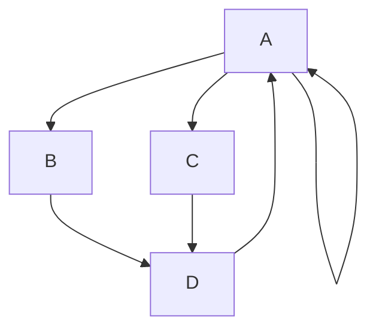

**how the hack** [ Bold text] __This is also Bold Text__

# This is Heading 1
## This is heading 2
### This is Heading 3

_I am fine_ [This is Italic] also this *bingo*

**I am a good _boy_ are you good**

**_I am bood_** Tis is bold and Italic

~~strike Through~~


Qouting my name.
> Partho Protim Das

This is a code

`Shoot I am fine`
```cpp
#include<stdio.h>

int main(){
    int a, b;
    sc3(a, b, c);

    for(int i = 0; i < n; i++){
        int sum = 0;
        sum += i;
    }
    return 0;
}
```

Here is a simple flow chart:

