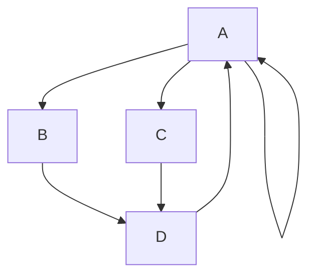

# Experiments

```cpp
#include<stdio.h>

int main(){
    int a, b;
    sc3(a, b, c);

    for(int i = 0; i < n; i++){
        int sum = 0;
        sum += i;
    }
    return 0;
}
```

Here is a simple flow chart:



The Link to Google: [Google Bot Kom](https://google.com)


* Bluey
- Bingo

- [x] partho :tada:
- [ ] box
- [ ] Issue #739

> [!NOTE]
> Please Note That


> [!TIP]
> Tips of the day

> [!IMPORTANT]
> This is important

> [!WARNING]
> Please go to Sleep

> [!CAUTION]
> Turn of the light


| Header 1 | Header 2 | Header 3 |
|----------|----------|----------|
| Cell 1   | Cell 2   | Cell 3   |
| Cell 4   | Cell 5   | Cell 6   |
| Cell 7   | Cell 8   | Cell 9   |
|----------|----------|----------|
| Cell 8   | Cell 11  | Cell 12  | 


